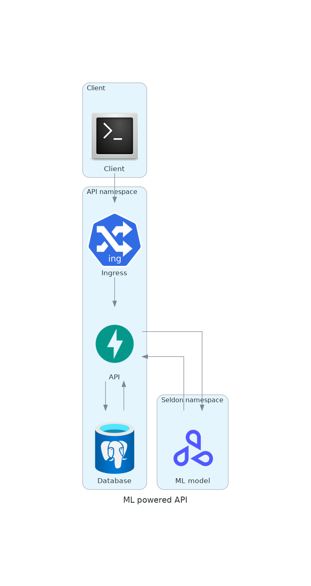

# Integrating a ML model in an API 🔀

&nbsp;

Mon 23 Jan, 2023

&nbsp;

In my [previous post](https://www.danielsteman.com/blog/5) I wrote about deploying an ML model using the Seldon Core library. At the end of the post we ended up with a `SeldonDeployment` kubernetes object which roughly resembles a standard `Deployment` object, but with some extras. When deployed, you'll end up with a micro service that runs in a pod and a service that exposes the pod.

&nbsp;

For a project I was working on, we needed more than just the service, we also needed to store predictions and handle some other business logic. Hence, I built an API with [FastAPI](https://fastapi.tiangolo.com/), which wraps the ML micro service. A very high level design is shown below.

&nbsp;



&nbsp;

Before, a client could call the ML micro service directly with a post request and a body, where the body contains the data that will be inferred. An example `cURL` request looks like this:

&nbsp;

```
curl -X POST -H 'Content-Type: application/json' -d '{"ndarray":{"data":[[1,3,3]]}}' http://application.cluster-domain:9000/api/v1.0/predictions
```

&nbsp;

The body, `[1,3,3]`, would be the input `X` in the `predict` method of a trained Scikit Learn model (or model trained with another library, which might have a different standard method).
In this scenario, data is not persisted.

&nbsp;

With an API in between, we can do anything we'd like with the incoming requests (from the client) and incoming responses (from the ML micro service), such as writing data to a database for later use. Prediction data is relevant for performance measurements, as a historical set of predictions can be compared to actual historical data points. This could be used to trigger retraining of the ML model, as described in this [MLOps article of Google](https://cloud.google.com/architecture/mlops-continuous-delivery-and-automation-pipelines-in-machine-learning). Data sent by the client is relevant because it accumulates to the next training set. Also, new data may have a different distribution compared to the old data that was used to initially train the model. Without storing data it would be impossible to know and it can affect model performance badly. This [blog post](https://superwise.ai/blog/data-drift-detection-basics/) about data drift explains the concept in some more detail.

&nbsp;

Enough about [MLOps things](https://ml-ops.org/). The tree below shows how I layered the application according to the tasks each component is fulfilling.

&nbsp;

```
.
├── alembic
│   ├── env.py
│   └── versions
│       └── create_tables.py
├── app
│   ├── __init__.py
│   ├── crud
│   │   ├── __init__.py
│   │   ├── base.py
│   │   └── classification.py
│   ├── db
│   │   ├── __init__.py
│   │   ├── base_class.py
│   │   └── session.py
│   ├── main.py
│   ├── ml
│   │   ├── __init__.py
│   │   ├── base.py
│   │   └── classifier.py
│   ├── models
│   │   ├── __init__.py
│   │   └── classification.py
│   ├── routers
│   │   ├── __init__.py
│   │   └── classification.py
│   └── schemas
│       ├── __init__.py
│       └── classification.py
├── deploy
└── tests
```

&nbsp;

## Tables

Let's start with `alembic`. [This](https://alembic.sqlalchemy.org/en/latest/) is the Python tool I'm using to migrate tables to the Postgres DB. It's easy to use, as it leverages the well known object-relational mapping (ORM) library `sqlalchemy` for declaring tables. I prefer setting up tables this way because the configuration will be kept in version control and is easy to reproduce in a CI/CD pipeline.

## Models

Each database table is also declared by a class with a `Base` parent class. To construct the `Base`, the [declarative API](https://docs.sqlalchemy.org/en/13/orm/extensions/declarative/api.html#sqlalchemy.ext.declarative.declared_attr) of `sqlalchemy` is used to map model class names to table names, for example:

&nbsp;

```
from typing import Any
from sqlalchemy.orm import as_declarative, declared_attr


@as_declarative()
class Base(object):
    __name__: str

    @declared_attr
    def __tablename__(cls) -> str:
        return cls.__name__.lower()
```

&nbsp;

## Schemas

These are `pydantic` classes that are used to validate requests and responses, by enforcing type hints. This way we can be sure that the expected features are sent to the ML model and that the ML model gives back an expected response.

&nbsp;

## Routers

Endpoints can be declared directly in `app/main.py` but I always find it more convenient to group endpoints in `Router`s and use the `include_router` method to attach them to the `App` object. In the below example, the `router` is not encapusulated in a separate file for demostration but should be in a real project.

&nbsp;

```
from fastapi import FastAPI, APIRouter

router = APIRouter(prefix="/classification")

app = FastAPI()
app.include_router(router)
```

&nbsp;

From the router, we can inject the ML model such that we can fetch predictions when we receive a request with features. The `app.ml.classifier.Classifier` model class is responsible for sending requests to the ML micro service, hence it should be [injected as a dependency](https://fastapi.tiangolo.com/tutorial/dependencies/).

&nbsp;

```
from fastapi import Depends

@router.post("")
def create_prediction(
    clf=Depends(Classifier),
) -> Any:
```

&nbsp;

The `Classifier` makes requests with the `requests` module, and because we are calling an interal Kubernetes service, the domain of the ML micro service is formatted like `my-svc.my-namespace.svc.cluster-domain.example`. You can find more info about the Kubernetes DNS [here](https://kubernetes.io/docs/concepts/services-networking/dns-pod-service/).
